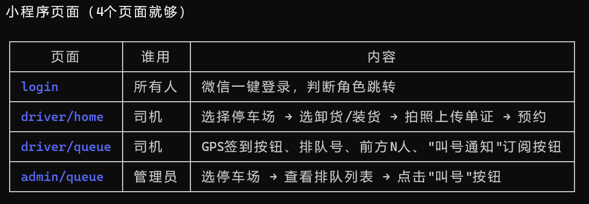

相关代码仓库：https://github.com/Yasin4088/ParkingLotProgram

>注：本项目所产生的一切费用在`报销清单.et`记录，等项目结束后均摊。

## 0、知识储备

>相关知识学习自行在哔站或网上学习。

1、相关网站

微信开发者平台：https://developers.weixin.qq.com/console/index?tab1=business&tab2=dev

微信公众平台：https://mp.weixin.qq.com/

2、比较好的开源项目（网上有很多，可自行查找）

https://github.com/kaixindexuegao/WiseParking（小程序界面可参考）

https://github.com/shuangyulin/weixin077_tingchechang (后端网页及管理者可参考)

https://github.com/line521356/LRMS

https://github.com/JackQChen/QueueSystem

## 1、第一阶段（8.8~8.15）--前端制作
相关目标要求：

登录界面，分为管理员与用户（司机）两个，通过账户名（或者手机号）与密码（或手机验证码登录），登录跳转到相应界面。

- 忘记密码的跳转
- 密码的初始化与后台管理

示例：

司机相应界面：在功能界面选择装货或卸货，跳转至选址界面，确定好地点后（点击或搜索），进入预约界面填写信息，预约，发送给管理者后台。（之后在司机手机上可查看排队号，实时更新排队情况，叫号通知（信息通知））-----四个界面

>管理者界面及后台服务器可再设计成网页后端（进阶版）

管理员界面：直接进入选址界面，点击或搜索每个停车场有相应的排队列表，操作叫号。----两个或三个界面

后台服务器：存储用户登录数据及密码（初定用MySQL）；接收排队信息，显示在管理员界面；管理员操作，通知司机 -----该部分偏后期一点。
